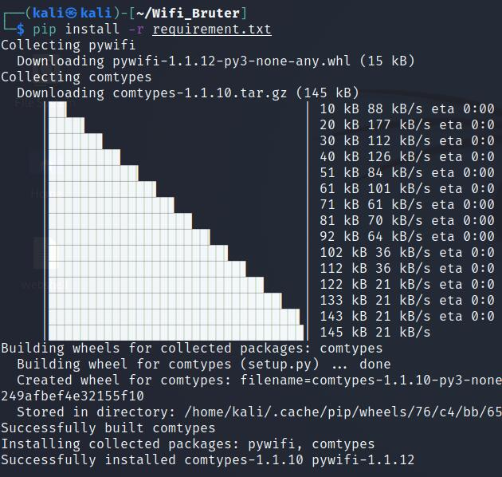

# WIFI_Bruter


[TOC]


## 介绍

通过python实现的WIFI破解器，基本原理是暴力破解

内置一个弱口令字典，可自由调节目标及密码字典

需要无线网卡


## 用法

### Python

在控制台输入

```bash
pip install -r requirement.txt
```

安装第三方库



------

输入

```bash
python3 Wifier.py console
```

进入程序控制台


------

输入

```
help
```

查看帮助信息


------

输入

```
test
```

测试网卡


------

输入

```
scan
```

扫描可用WIFI列表

其中第一个值WIFI名，第二个为信号强度


在这里以**ChinaNet-401**为例

------

输入

```
options
```

显示扫描参数


其中**target**，**passwords**，**timewait**是三个必选参数，分别代表**扫描目标**，**密码字典(默认为自带字典)**，**连接时间(默认为1.5)**

通过

```
set
```

对参数进行修改


------

通过

```
run
```

启动爆破

如果爆破成功，会输出密码并自动连接


------

输入

```
dump
```

导出结果


------

通过

```
system
```

执行系统指令


------

通过

```
exit
```

退出程序


### exe

在控制台输入

```bash
wifier.exe console
```

打开控制台

剩余步骤与上述一致


## Github

[https://github.com/13337356453](https://github.com/13337356453)

